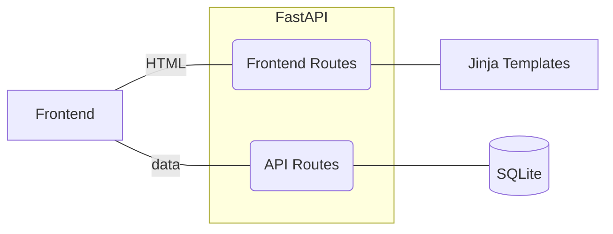

# Welcome to FastAPI-SQLAlchemy

## Project layout

    app/
     ├── api/           # api routes
     ├── core/          # configuration
     ├── db/            # db connectivity
     ├── models/        # orm models
     ├── static/        # static frontend assets
     ├── templates/     # frontend templates
     └── main.py
    docs/               # project docs (mkdocs-material)
     └── index.md
    migrations/
     ├── versions/
     ├── env.py
     ├── README
     ├── script.py.mako
     └── seed.py
    alembic.ini
    db.sqlite           # sqlite database
    docker-compose.yml
    Dockerfile          # application docker image
    Dockerfile.mkdocs   # customized mkdocs-material image
    mkdocs.yml
    poetry.lock
    prestart.sh         # runs migrations on deployment
    pyproject.toml
    README.md
    tasks.py            # housekeeping tasks (pyinvoke)
